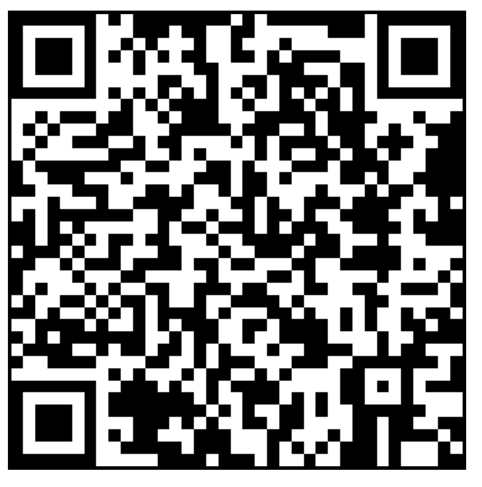

# Open Source Hardware Instrument(OSHI)

 - [QCode Table](qrcode/table.html)
 - [QCode Table Generator](qrcode/)

The purpose of science instruments is to extend the shared nervous system of humanity. The purpose of the open source hardware instrument (OSHI) is to replicate science instruments as widely as possible, to navigate their evolution and improvement, and to coordinate the flow of information from the instruments . 

We break up the OSHI into as many fractal parts as needed so that each part can itself replicate. This is generally broken down by type into electrical, mechanical,  informational.  We build the documentation required not only to copy a thing but to copy it economically and at scale.  We build the social network infrastructure required to allow sponsors to pay for any number of instruments, which are then used by performers who use the instruments to gather and publish data. 

Each element of an open source hardware instrument must communicate why it exists and why a user would want to replicate it.  Each element links with the other elements in a network of hyperlinks in their documentation. Each element has its own sub directory with a README.md file and a QR code which links back to a global url on the open web which hosts that Readme. Each readme has a title linking back to itself. 

The OSHI code set itself is a minimal self replicating HTML document which displays the markdown in the README. it has that as an element.  The OSHI code repo follows its own plan. It is a fractal self replicating set. 

Why does this exist?

These go in an "action" category of elements:

How to buy?
How to sell?
How to sponsor?
How to get a free instrument?

Electrical
Mechanical 
Informational

Qr codes are an element 
Html is an element 
Markdown is an element 
Thermal printer is an element, Mechanical
The demo model is the thermotron, which is a thing. 
  

Thermotron is an element of OSHI, and OSHI is an element of thermotron. 

Open Source Hardware Instruments are collections of free and open source physical technology which extend the shared nervous system of Humanity.  The goal of the OSHI movement is to build a network of such instruments, which taken together can extend our perception more deeply into the world directly around us.  We aim to make free instruments which can scale up to billions of users, making them available to all of Humanity. We will measure our direct environment, focusing on air, soil, rock, water, the bodies of living organisms, and the physical elements of our own technology.  And within mainstream Big Science we will democratize access to the products of our work, aiming to dramatically lower costs and complexity of operation of "advanced" scientific measurement.  

This document is a meta-document for OSHI in general, serving as a guide for creating the documentation for any given instrument we might build.

The very top main page linked to from all elements of the project should answer the questions of who, what, why, where, how, and when.   It should be made clear what exactly this instrument does, why it was made, who made it, when, and in what institution, and how it compares to existing instruments already in the field. 

A OSHI should be available for sale in such a way that a customer can simply buy it without needing to do any kind of custom build.  The process by which it is bought and sold must be documented in such a way that anyone willing to carefully read the instructions and find the capital can simply buy inventory, set up a e-commerce page, and start selling. 

The top level documentation breaks up the instrument into sub-systems, each of which has its own documentation, with a fractal structure. Sub-systems are designed to be as modular as possible, each with its own reason for existing, and its own comparison to other ways of solving whatever problem it solves. Each sub-system and the top level documentation all have QR codes which can be printed and placed on the physical instances of the thing being documented.  QR codes should all also have a human readable global url pointing to the same web document.

A data format is specified in [JSON(JavaScript Object Notation)](https://en.wikipedia.org/wiki/JSON) which includes both data from the instrument and metadata such as who operated the instrument, where it was operated, what was being measured, various instrument settings and so on.  These files, in spite of being in JSON format, will all end with .txt for maximum human readability. They will all be published to public web pages along with JSON files which index the data for that data set.  These data sets are all then shared via public web resources in such a way that they can be aggregated and researchers can combine data sets, analyze and plot them, and then share the analysis files in open formats also on the Web.  In most cases we will share data analysis in either Python using Jupyter notebooks or JavaScript built into self-replicating web documents.

Instructions for DIY making of small numbers of the instrument for non-commercial use need to have a detailed bill of materials with live hyperlinks to buy each element of the list, and each element should have a price. Files should be both in the original format that created them and also in whatever format is needed to order the parts without editing them. For example, if someone used Altium to design printed circuit boards but Gerber files to actually order them from the factory, the repository of files should indclude both the Altium and the Gerbers, all in one place.  Files should all be linked to from the README, and users should never be forced to click files at random or guess where files are.  Information on what has already been purchased, from whom, for how much, how it worked out, should be as detailed as possible.  Share screen shots as needed to show exactly how to buy each element from some vendor.

There should be a mechanism by which any new instances of the instrument are linked to and from the existing instances. As a network grows of people making and using an instrument, everyone should be sharing information across the whole network, building network effects to better data and also improvements in the instrument.  

The constituent elements of the OSHI should all have their own folder in the Git repository(collection of files), each of which has a README.md Markdown file documenting that element.  These folders can be as fractal as they need to be to ensure that each object intended for replication can itself be made to fit all the criteria in this document. 

Each document should state what unsolved problems remain in the improvement of the element being documented, along with contact information as needed to get a contributor trained to the point that they can move the work forward.
