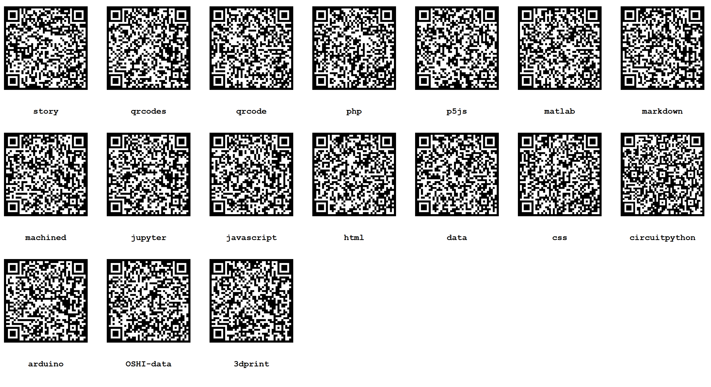

# [Back up to OSHI](../)




# QR Codes

 - [qrcode.js](https://github.com/davidshimjs/qrcodejs)
 - [webeditor.html](webeditor.html)
 - [qrcode table](qrcode-table.html)
 - [qr code table generator](qrcode-table-generator.html)


Include this code in the "head" element at the top of an html file to call the qrcode javascript library:

```
   <script src = "https://cdnjs.cloudflare.com/ajax/libs/qrcodejs/1.0.0/qrcode.min.js"></script>
```

Then to make a QR code, create a div element called "qrcode" copy this code into the javascript:

```
codesquaresize = 170;
globalurl = window.location.href;
qrcode = new QRCode(document.getElementById("qrcode"), {
	text: globalurl,
	width: codesquaresize,
	height: codesquaresize,
	colorDark : "#000000",
	colorLight : "#ffffff",
	correctLevel : QRCode.CorrectLevel.H
});
```

to make a QR code of size codesquare and pointing to the url in the browser bar.
